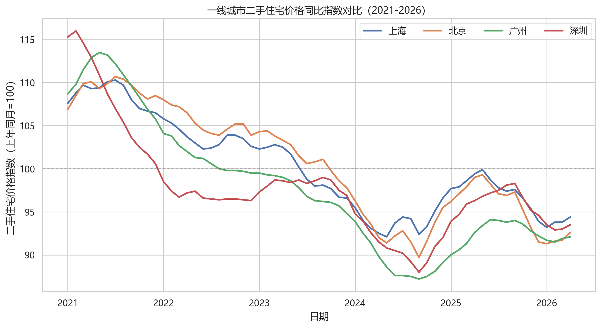
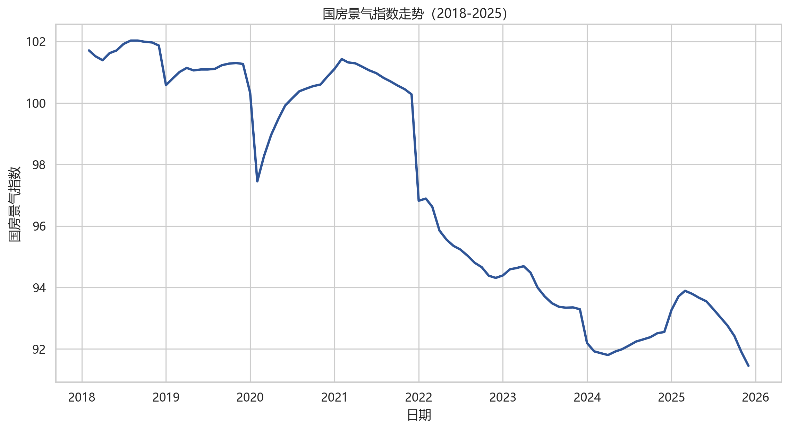
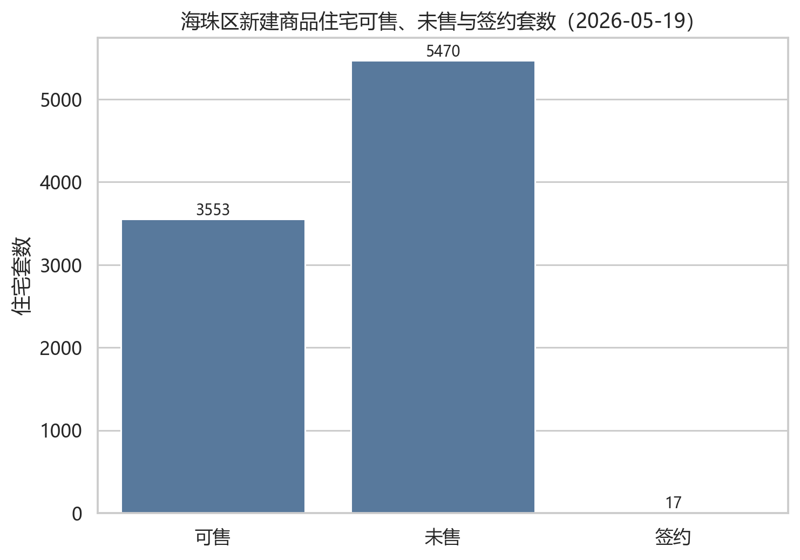
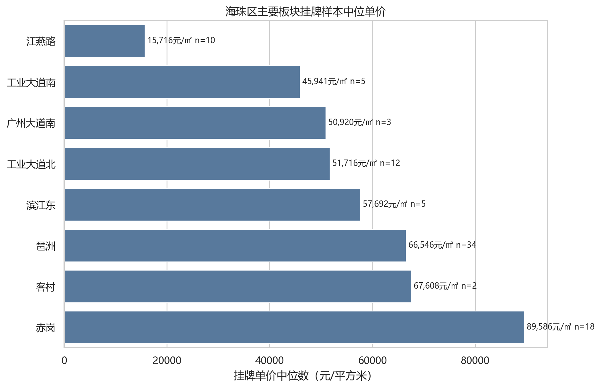
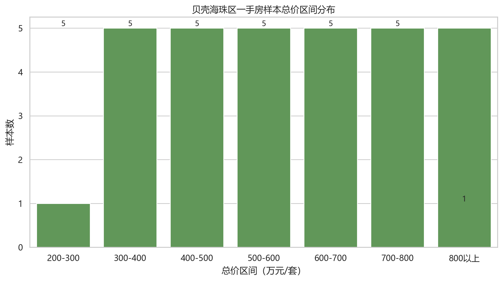
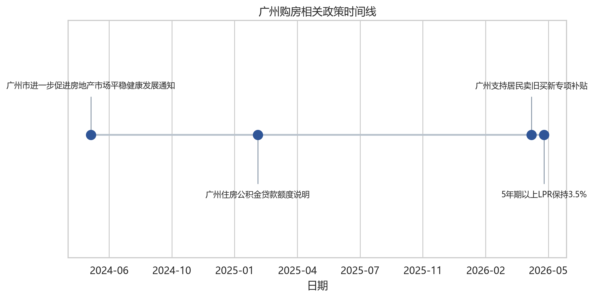

# 广州市海珠区未来房价走势与消费者购房时机判断

## 首页信息

| 项目 | 内容 |
|---|---|
| 课程 | 数据分析与经济决策（ds2026） |
| 作业 | Team02 小组作业 |
| 小组 | 第一组（G01） |
| 主题 | 广州市海珠区未来房价走向，消费者今年购房是否合时？ |
| 决策主体 | 计划在广州市海珠区购房的自住型刚需与改善型消费者 |
| 日期 | 2026-05-24 |

## 1. 制作背景：为什么做这份报告

这份报告的出发点不是单纯描述海珠区房价，而是帮助一个真实的购房者做决策：如果今年想在广州海珠区买房，应该现在入场、继续观望，还是只关注特定板块和项目？

海珠区的判断难点在于它同时具备两面性。一方面，海珠位于广州中心城区，琶洲数字经济、总部经济和会展经济提供了长期产业支撑；另一方面，广州和全国房地产仍处于调整周期，海珠区人口增长偏弱，二手房价格仍有压力，新房供应和改善型项目也在增加。因此，不能只凭“核心区”或“热销楼盘”就得出买入结论。

本报告面向课堂展示设计，开场先给出结论，再解释分析意图，然后展示关键数据，最后说明制作过程和数据来源。这样的顺序能让观众先明白判断结果，再理解为什么这些数据能够支撑这个判断。

| 展示环节 | 作用 | 对应内容 |
|---|---|---|
| 先给结论 | 让观众立刻知道报告判断 | 是否适合买、适合谁买、风险在哪里 |
| 解释分析意图 | 说明为什么选这些数据 | 人口、产业、供应、宏观、成交、支付能力 |
| 展示关键数据 | 用证据支撑结论 | 人口流入、供应链产业结构、宏观数据、平台样本 |
| 说明制作过程 | 增强可信度和可复现性 | 数据来源、清洗逻辑、图表生成和局限性 |

## 2. 核心结论：先给答案

本报告面向计划在广州市海珠区购房的消费者，围绕“2026 年是否适合在海珠区买房”这一决策问题展开。最直接的结论是：

> 海珠区不是“全面适合买入”，而是“结构性适合买入”。现金流稳定、目标明确的自住和改善型家庭，可以重点关注核心板块和价格合理项目；投资型和预算紧张型购房者应保持谨慎。

| 结论问题 | 直接判断 | 主要依据 |
|---|---|---|
| 海珠区房价是否已经全面反转？ | 没有，不宜判断为全区普涨 | 二手房仍有同比下行压力，新房与二手房价差明显，宏观房地产景气仍处低位 |
| 哪些区域更值得关注？ | 琶洲、滨江东、赤岗等核心板块更具支撑 | 产业集聚、通勤配套和改善需求更集中 |
| 今年是否可以买？ | 自住和改善可择优买入，投资需谨慎 | 政策降低门槛，但人口新增偏弱、供应压力和月供压力仍存在 |
| 最关键的判断变量是什么？ | 人口、产业、供应结构和支付能力 | 它们决定需求来源、购买力、价格压力和家庭承受能力 |

| 消费者类型 | 今年购房判断 | 理由 |
|---|---|---|
| 刚需自住、预算稳定 | 可以积极看房、择优买入 | 政策降低成本，二手房议价空间仍在，自住需求不宜过度择时 |
| 核心板块改善型购房者 | 可以谨慎推进 | 琶洲、滨江东、赤岗等板块有产业和配套支撑，但需控制总价和置换周期 |
| 非核心老旧小区置业者 | 建议充分比价 | 人口支撑偏弱，老旧小区可能继续承压，应重点比较楼龄、地铁、学位和未来流动性 |
| 投资型购房 | 不建议作为主策略 | 房价弹性、租金回报和流动性均不确定，难以仅靠产业故事支撑投资收益 |
| 预算紧张、收入不稳定 | 建议暂缓 | 高总价区域月供压力大，需保留现金流安全边际 |

阶段性判断如下：

1. 短期 6-12 个月：海珠区房价仍以承压和跌幅收窄为主。若全国房地产景气指数未明显修复、二手房挂牌压力未下降，二手房均价仍可能在低位波动。
2. 中期 1-3 年：更可能出现“核心板块企稳、非核心老旧小区继续调整”的分化格局。琶洲、滨江东、赤岗等产业和通勤优势明显的板块更容易率先企稳。
3. 长期 3-5 年：若琶洲产业人口红利兑现，且高薪就业人群形成稳定购房需求，海珠核心板块有望进入产业驱动型修复；若人口继续外流，产业增长对房价的传导会被削弱。

## 3. 分析意图：为什么这样分析

本报告的展示逻辑不是先堆数据，而是先回答“为什么这些数据与购房决策有关”。整体思路是：先判断海珠区有没有长期需求支撑，再判断短期价格压力来自哪里，最后回到消费者本人是否承受得起。

| 分析模块 | 主要意图 | 展示时可使用的表达 |
|---|---|---|
| 人口流入 | 判断新增购房需求是否充足 | 人口数据回答的是“有没有更多人需要在这里住、在这里买”。 |
| 供应链与产业结构 | 判断未来购买力是否存在 | 产业数据回答的是“未来有没有稳定就业和高收入人群支撑房价”。 |
| 供应结构与一二手价差 | 判断短期价格压力来自哪里 | 如果新房供应增加、二手房仍在降价，说明市场不是单边上涨，而是产品和价格结构正在分化。 |
| 宏观房地产数据 | 判断大周期是否支持反转 | 海珠再有优势，也仍处在全国房地产调整周期的大背景下。 |
| 官方成交与热盘案例 | 判断市场热度是否真实存在 | 官方签约和网签数据用来验证热度，不只依赖媒体报道或平台宣传。 |
| 平台挂牌样本 | 判断消费者真实面对的报价区间 | 链家、贝壳、房天下样本帮助我们看到一手和二手之间的选择差异。 |
| 月供收入比 | 判断今年是否买得起 | 即使房价合适，如果月供压力过高，也不能算是合适的购房时机。 |

从判断权重看，本报告将人口、产业和供应结构放在更靠前的位置，因为它们直接决定“需求从哪里来、购买力能否持续、供给压力是否压住房价”。政策和热盘案例可以改变短期情绪，但不能单独决定区域房价趋势。

| 判断维度 | 权重 | 为什么靠前分析 |
|---|---|---|
| 人口基本面 | 高 | 决定新增刚需和租转买需求是否充足，是房价长期需求底盘。 |
| 产业结构 | 高 | 决定就业质量和高收入购买力，尤其影响琶洲、滨江东、赤岗等核心板块。 |
| 供应结构 | 高 | 房地产开发投资和新房供应会影响去化压力，也会通过一二手价差影响消费者选择。 |
| 宏观周期 | 中高 | 用于判断市场是否具备整体反转条件。 |
| 价格和成交热度 | 中高 | 用于验证市场是否已经出现实际修复，但需要结合基本面解释。 |
| 政策环境 | 中 | 降低购房门槛和交易成本，但无法完全消除房价下行和流动性风险。 |
| 支付能力 | 高 | 最终决定消费者是否能买、是否应该现在买。 |

## 4. 关键数据展示：按重要性展开

### 4.1 人口流入：广州强，海珠偏弱

| 指标 | 数据表现 | 对购房需求的含义 |
|---|---|---|
| 广州市常住人口 | 2025 年末 1910.10 万人，较 2024 年增加 12.30 万人 | 广州整体仍有较强人口吸引力，为核心城区提供长期需求底盘 |
| 海珠区常住人口 | 2025 年末 177.07 万人，较 2024 年仅增加约 0.08 万人 | 海珠人口恢复力度弱于全市，新增刚需支撑有限 |
| 海珠区户籍人口 | 2025 年末 112.08 万人，较 2024 年增加约 0.50 万人 | 可能反映购房落户、存量家庭稳定化和改善置换需求 |
| 海珠区非户籍人口推算 | 2025 年约 64.99 万人，低于 2022 年约 69.48 万人 | 外来常住人口有所收缩，租转买和新增刚需偏弱 |

人口数据说明，海珠区不是单纯依靠人口扩张推动房价的区域。其更可能依赖存量家庭改善、核心产业人群和优质资产稀缺性形成结构性需求。因此，人口因素对短期房价并非强支撑，而是中长期观察变量。

### 4.2 供应链与产业结构：琶洲提供长期支撑

| 指标 | 2025 年表现 | 信号 |
|---|---:|---|
| 海珠区 GDP | 3136.07 亿元，同比 +5.5% | 经济总量和增速具备中心城区支撑 |
| 第二产业增加值 | 545.28 亿元，同比 +9.5% | 工业和新型产业动能增强 |
| 第三产业增加值 | 2589.54 亿元，同比 +4.7% | 服务业仍是海珠经济主体 |
| 税收总额 | 356.01 亿元，同比 +8.4% | 财政和企业经营基础较稳 |
| 社会消费品零售总额 | 1051.41 亿元，同比 +11.8% | 消费活力较强，商业配套改善 |
| 固定资产投资 | 同比 +11.9% | 项目投资仍在扩张 |
| 工业投资 | 同比 +48.1% | 产业落地速度较快 |
| 房地产开发投资 | 同比 +19.0% | 同时意味着新房供给和去化压力增加 |
| 新增“四上”企业 | 2024 年 841 家，创历史新高 | 企业集聚增强，就业和高收入岗位有潜在支撑 |

琶洲试验区是海珠区最关键的长期变量。附件资料显示，琶洲围绕数字营销、数字文娱、数智美妆等赛道形成集聚，互联网/软件业营收增长较快，并叠加会展经济和总部经济。腾讯广州总部大楼竣工投产、头部企业集聚和“世界一流数字经济发展高地”等定位，均有利于提升核心板块的就业质量和购买力。

但产业增长不必然立即转化为房价上涨。关键问题在于：新增岗位是否形成稳定高收入家庭、这些人是否选择在海珠置业，以及一手高总价改善产品能否被本地购买力持续消化。

### 4.3 供应结构与一二手价差

供应结构是本报告前置分析的重点之一。附件数据显示，海珠区 2025 年房地产开发投资同比增长约 19.0%，说明项目投资和新房供给仍在扩张。供给增加本身不是坏事，它可以改善产品品质、增加改善型选择；但在二手房价格仍承压、人口新增偏弱的背景下，新增供应也会带来去化压力和价格竞争。

附件中整理的安居客、58 同城等平台口径显示，海珠区二手房展示均价在 2025 年下半年至 2026 年 5 月仍处调整区间。2026 年 5 月二手房均价约 39387 元/平方米，环比约 -0.24%，同比约 -12.13%；同期新房公示均价约 70119 元/平方米。

从消费者角度看，供应结构变化会形成两种选择：一类是总价较高、产品较新的改善型新房，另一类是总价更低、可议价空间更大的二手房。若新房持续以高端改善盘为主，而二手房挂牌价继续调整，消费者会更需要比较“品质溢价是否值得支付”，而不是只看单个新盘是否热销。

### 4.4 宏观数据：广州大盘和全国周期

这张图用于判断广州整体房价是否已经企稳。若新房指数先于二手房指数改善，说明政策和新盘供给对市场预期有一定支撑；若二手房指数仍低于 100，则代表存量房市场仍有调整压力。

这张图用于判断广州在一线城市中的相对位置。如果广州二手房指数修复慢于北京、上海或深圳，说明广州市场仍偏弱；如果广州环比或同比改善更明显，则可作为市场情绪回升的证据之一。

国房景气指数反映全国房地产行业景气程度。若指数仍处于低位，说明海珠区热盘热销更多体现为核心资产和优质项目的结构性机会，而不是全国房地产市场已经全面反转。

### 4.5 海珠市场数据：成交、案例和挂牌样本

本项目从广州市住建局“商品房销售统计信息”页面的公开接口获取每日数据。该页面说明数据为纳入网上签约管理范围的数据，用于观察广州各区新建商品房可售、未售与签约情况。

截至 2026 年 5 月 19 日，海珠区新建商品住宅当日签约 17 套、签约面积 1748.05 平方米；可售住宅 3553 套、未售住宅 5470 套。和增城、黄埔、番禺等区相比，海珠区当日签约规模处于中上位置，但仍不能仅凭单日数据判断持续性回暖。

数据显示，2026 年 3 月中旬以来广州市二手住宅周度网签大多维持在 2000 宗以上；其中 5 月 11 日-5 月 17 日，全市二手住宅网签 2407 宗，协会正文提到“番禺区和海珠区的网签超过300宗”。这说明海珠区在二手住宅市场中同样具有一定成交活跃度，但周度波动仍较明显。

本项目爬取并整理新浪财经、财联社/界面新闻、新快报、证券时报/证券日报、东方财富等公开报道。可验证信息显示，保利海韵位于海珠区南泰路/海珠西片区，2026 年 5 月 10 日首推约 300 套以上房源，多家媒体报道其短时间售罄，认购金额约 18 亿至 18.2 亿元，部分报道提到认筹超过 700 组。

这说明广州核心区改善需求仍然存在，优质新盘在政策支持和价格预期变化下能够快速去化。但保利海韵属于区位、价格、产品和营销叠加的个案，其热销更适合作为“优质项目结构性走强”的证据，而不是“海珠区全域房价全面上涨”的证据。

房天下海珠区公开列表页可解析，本项目低频采集前 2 页共 120 条挂牌样本。需要注意的是，该样本是公开挂牌价，不是网签成交价；样本中也包含公寓、别墅和非标准住宅产品，因此只能作为市场报价和板块分化的辅助证据。

### 4.6 用户补充链家和贝壳样本

小组补充的链家海珠二手房源 CSV 包含 30 条样本，字段包括房源 ID、小区/楼盘、挂牌总价、单价、建筑面积、户型、朝向、楼层、装修、建成年份和挂牌时间等。清洗结果显示，该样本的二手挂牌中位单价约 31692 元/平方米，中位总价约 262 万元，中位面积约 74.83 平方米。

小组补充的贝壳海珠一手房 CSV 包含 31 条样本，字段包括楼盘、楼盘参考均价、总价参考、本套建筑面积、户型、朝向、地址和项目特色等。清洗结果显示，该样本的一手项目中位参考单价约 55000 元/平方米，中位参考总价约 575 万元，中位面积约 110 平方米。

从样本对比看，一手项目的单价、总价和面积中位数均高于二手挂牌样本，说明海珠区消费者若选择新房改善项目，需要面对更高的总价门槛；若预算较紧，二手市场仍可能提供更低总价带的选择。但两份样本规模有限，且分别代表平台挂牌价和平台参考价，因此更适合作为价格结构和购房门槛的辅助证据。

### 4.7 支付能力：最后回到消费者本人

本报告采用等额本息、贷款 30 年、基准年利率 3.5% 的简化假设，测算不同总价住宅的月供压力。该测算不构成银行审批结果，仅用于消费者决策比较。

在首付 20%、年利率 3.5% 情景下，400 万总价住宅对应月供约 1.44 万元；600 万总价住宅月供约 2.16 万元。若家庭月收入为 3 万元，400 万住宅月供收入比约 47.9%，600 万住宅约 71.8%，已经进入较高压力区间。因此，“是否合时”不仅取决于房价走势，也取决于家庭现金流和风险承受能力。

## 5. 制作过程：数据如何获得和处理

### 5.1 确定决策对象和核心问题

本报告的决策主体是计划在广州市海珠区购房的普通消费者，尤其是刚需自住者和改善型购房者。前者关注通勤、居住稳定性、教育和生活配套；后者关注居住品质、资产置换、板块成长性和未来流动性。

核心问题包括：

- 当前政策是否明显降低购房成本？
- 广州房价指数是否出现企稳或反弹？
- 海珠区楼盘热销是否具有普遍代表性？
- 消费者今年买房、观望或暂缓的条件分别是什么？

### 5.2 数据来源设计

本报告采用五类数据证据：

第一，宏观与城市层面数据。使用国家统计局及 AkShare 获取全国房地产景气指标、广州新建商品住宅和二手住宅价格指数，并与北京、上海、深圳进行比较。

第二，广州和海珠区成交数据。使用广州市住建局“商品房销售统计信息”公开接口，整理 2026 年 5 月 19 日广州各区新建商品住宅可售、未售和签约数据；使用广州市房地产中介协会“一周独家数据”栏目，整理近 10 周广州市二手住宅网签宗数及海珠区相关文字说明。

第三，微观样本和案例。对链家、贝壳、58 同城、安居客、房天下等平台公开页面进行合规访问尝试；链家、贝壳、58 同城和安居客因登录、验证码或短壳页面未继续自动化采集，房天下公开列表可解析，整理 120 条海珠区挂牌样本；同时爬取主流新闻网站中关于保利海韵开盘热销的报道。

第四，用户补充平台样本。将小组补充的链家海珠二手房源 CSV 和贝壳海珠一手房 CSV 纳入项目，分别清洗出 30 条二手房挂牌样本和 31 条一手房项目/户型样本，用于与房天下样本、官方成交热度数据进行交叉说明。

第五，人口、产业与区域基本面补充数据。根据小组补充的《海珠区房价趋势分析报告》，整理广州及海珠区 2022-2025 年常住人口、户籍人口、海珠区 2025 年 GDP、固定资产投资、工业投资、房地产开发投资、社零总额、税收和“四上”企业新增情况，用于判断房价的中长期支撑与短期压力。

### 5.3 数据获取可行性与合规处理

AkShare 可用于复现宏观和城市层面数据：

- `macro_china_new_house_price()`：获取广州等城市新建商品住宅和二手住宅价格指数。
- `macro_china_real_estate()`：获取国房景气指数。

局限性是：AkShare 数据主要到城市层面，不能精确到海珠区，也不能直接反映单个楼盘成交情况。

链家/贝壳适合作为海珠区二手房挂牌样本和一手项目样本补充。本项目没有绕过平台登录、验证码或访问限制，而是采用用户补充 CSV 作为微观样本。报告中明确说明：挂牌价和平台参考价代表卖方报价、项目报价或平台展示信息，不等于真实成交价。

广州本地数据应作为主证据，包括：

- 阳光家缘：一手住宅项目、网签和楼盘信息。
- 广州市房地产中介协会：二手住宅市场月度运行情况。
- 广州市住建局：政策文件和市场监管信息。

### 5.4 指标设计

| 指标 | 含义 | 数据来源 |
|---|---|---|
| 新建商品住宅价格指数同比/环比 | 广州新房价格变化 | 国家统计局/AkShare |
| 二手住宅价格指数同比/环比 | 广州二手房价格变化 | 国家统计局/AkShare |
| 国房景气指数 | 全国房地产市场景气度 | AkShare |
| 海珠区挂牌单价 | 海珠二手房卖方报价 | 链家/房天下挂牌样本 |
| 海珠区一手项目参考价 | 海珠新房项目报价和总价带 | 贝壳一手房样本 |
| 开盘去化率 | 新盘热度 | 楼盘公开报道/阳光家缘 |
| 常住人口和户籍人口变化 | 潜在购房需求和人口吸附能力 | 广州市统计局、海珠区统计局、小组补充资料 |
| GDP、投资和企业新增 | 产业基本面对就业和购买力的支撑 | 海珠区统计局、小组补充资料 |
| 房地产开发投资 | 新房供应和去化压力 | 海珠区统计局、小组补充资料 |
| 月供收入比 | 消费者支付压力 | 自行测算 |

### 5.5 代码和输出文件

项目按步骤保留数据获取、清洗、制图和导出脚本：

- `codes/01_get_data_akshare.py` 至 `codes/09_integrate_user_house_data.py`：完成宏观数据、平台样本、官方成交、新闻案例和用户补充数据处理。
- `codes/06_render_report_html.py`：将 Markdown 报告渲染为 HTML。
- `codes/10_render_interactive_standalone_html.py`：生成可复制到其他电脑直接展示的离线交互 HTML。
- `output/fig01` 至 `output/fig14`：保存本报告使用的全部图表。

## 6. 研究背景与政策环境

近年来，房地产行业仍是中国宏观经济的重要组成部分，房地产开发投资、商品房销售、居民按揭贷款和地方土地财政都与宏观经济运行密切相关。为了稳定房地产市场，国家和地方陆续出台降低首付比例、降低房贷利率、优化限购、支持“以旧换新”等政策。

广州作为一线城市，房地产市场具有明显分化特征。海珠区位于广州中心城区，具备琶洲数字经济集聚区、珠江沿岸景观资源、老城生活配套和地铁通勤优势，因此在改善型需求中具有较强吸引力。2026 年 5 月，海珠区保利海韵项目出现开盘热销，也进一步提升了市场关注度。

广州近期政策总体方向是降低购房门槛、支持改善置换、稳定市场预期。对消费者而言，政策利好主要体现在购房资格、首付比例、公积金额度和“卖旧买新”补贴等方面；但政策只能降低交易成本，不能消除房价波动和流动性风险。

## 7. 局限性

1. 海珠区微观成交价数据公开程度有限，贝壳/链家挂牌价和平台参考价不能直接代表成交价。
2. 单个热销楼盘可能受到地段、价格、产品和营销影响，不能简单外推到全区。
3. 房价走势受政策、利率、收入预期、土地供应和人口流动影响，预测具有不确定性。
4. 人口、产业和平台均价补充数据来自小组整理资料，不同统计口径之间可能存在时间和样本差异，因此主要用于方向判断和交叉验证。

## 8. 参考资料

- 广州市住房和城乡建设局：商品房销售统计信息，https://zfcj.gz.gov.cn/zfcj/tjxx/spfxstjxx/index.html
- 广州市住房和城乡建设局：存量房交易登记统计信息，https://zfcj.gz.gov.cn/xysj/fwxx/clfjydjtjxx/index.html
- 广州市房地产中介协会：一周独家数据，https://www.gzrea.org.cn/website/website_scyj_scyjList.action?pdid=205
- 广州市统计局：广州市国民经济和社会发展统计公报
- 海珠区统计局：海珠区统计公报及主要经济指标简要分析
- 海珠区人民政府：海珠区经济运行情况公开信息
- 广州市人民政府：广州市进一步促进房地产市场平稳健康发展通知，https://www.gz.gov.cn/zwgk/fggw/sfbgtwj/content/mpost_9674048.html
- 广州市人民政府：广州住房公积金贷款额度说明，https://www.gz.gov.cn/zt/shb/content/mpost_10129232.html
- AkShare 宏观数据文档，https://akshare.akfamily.xyz/data/macro/macro.html
- 新浪财经/乐居财经：90秒售罄！保利海韵开盘“日光”，销售额18亿元，https://finance.sina.com.cn/stock/estate/zc/2026-05-10/doc-inhxmeai7686815.shtml
- 新浪财经/财经网：广州新政后首个“日光盘”诞生——保利海韵售罄，https://finance.sina.com.cn/roll/2026-05-11/doc-inhxnwmm1954255.shtml
- 财联社/界面新闻：广州楼市诞生新政后首个“日光盘”，300套房源两分半钟全部售罄，https://www.cls.cn/detail/2368514
- 新快报：穗八条后广州首现“日光”盘！保利海韵300余套房两分钟售罄，https://xxsb.gz-cmc.com/pages/2026/05/10/9316ee36c2ab4a1a9648ea36537b43c9.html
- 房天下广州海珠二手房公开列表，https://gz.esf.fang.com/house-a074/
- 用户补充链家海珠二手房源 CSV：`data/raw/lianjia_haizhu_secondhand_user.csv`
- 用户补充贝壳海珠一手房 CSV：`data/raw/beike_haizhu_newhome_user.csv`
- 小组补充基本面资料：`data/raw/haizhu_fundamental_supplement.md`
