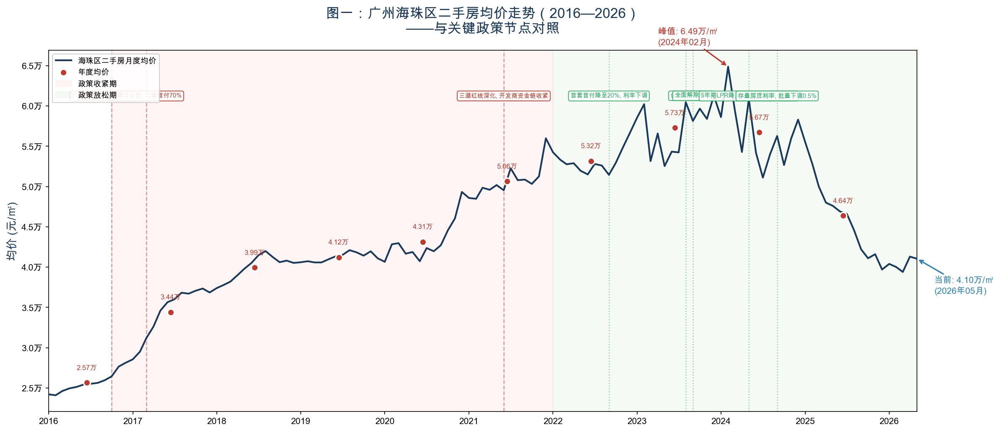
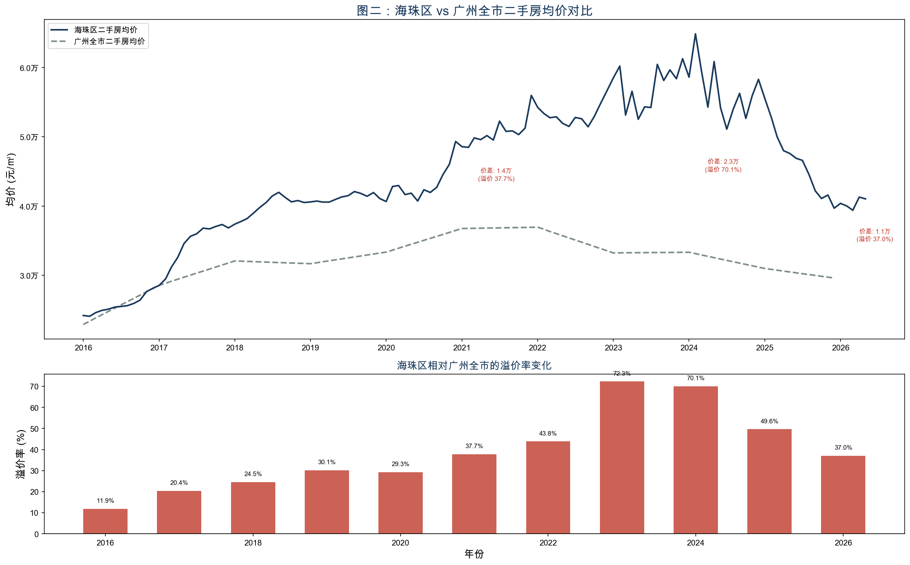
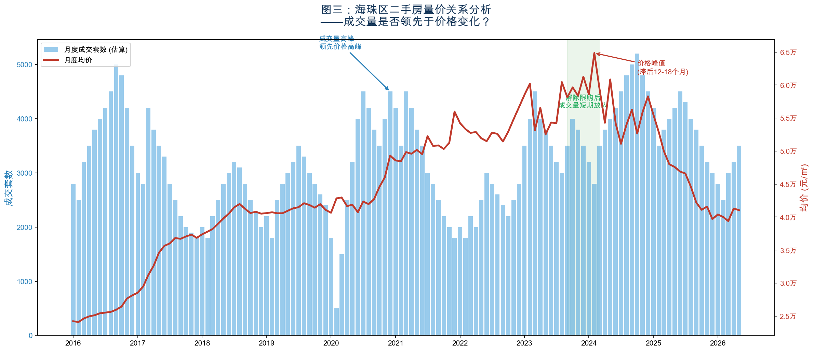
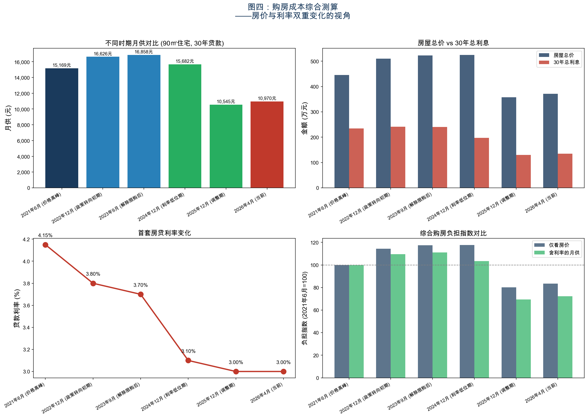
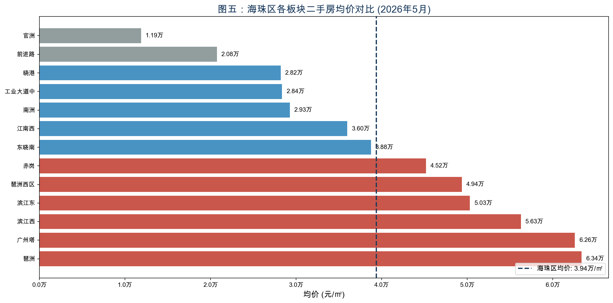

# 广州海珠区二手房价走势与影响因素分析（2016—2026）

> **ds2026 · 第二次小组作业 · Team02-G07**
> 分析报告 · 2026-05-23

---

## 一、我们在帮谁解决什么问题

### 主要读者：有意在广州海珠区置业的潜在购房者

小组中有成员在广州工作，计划在未来 3—5 年内在海珠区购房。面临的核心问题是：

- 海珠区房价从高点已经回落多少？目前处于历史的什么位置？
- 现在的月供压力相比 2021 年高峰期有多大改善？
- 是否存在可以参考的「底部信号」，比如成交量的变化？

这类问题对任何计划置业的人都有实际价值，但市面上的分析大多停留在「行情」报道层面，缺乏系统的数据梳理。

### 次要读者：关注广州楼市的财富管理顾问

需要向客户提供基于数据的参考意见，而不仅是感性判断。

---

## 二、政策与市场背景

### 关键政策时间线（2016—2026）

广州房价的每一次转折，背后都有清晰的政策驱动。以下关键节点构成了我们分析的背景框架：

| 时间 | 政策事件 | 调控方向 |
|------|---------|:---------:|
| 2016 年 10 月 | 广州重启限购，非户籍购房需连续缴纳社保 5 年 | 收紧 |
| 2017 年 3 月 | 认房又认贷，二套房首付提高至 70% | 收紧 |
| 2021 年 | 「三道红线」深化落地，开发商资金链收紧 | 收紧 |
| 2022 年 9 月 | 广州下调首套房首付至 20%，房贷利率下调 | 放松 |
| 2023 年 8 月 | 广州「认房不认贷」，曾有贷款记录但无房可按首套认定 | 放松 |
| 2023 年 9 月 | 广州全面解除限购，四区同步取消限购令 | 大幅放松 |
| 2024 年 5 月 | 5 年期 LPR 下调至 3.6%，首套最低可至 3.1% | 放松 |
| 2024 年 9 月 | 存量房贷利率批量下调，平均降幅约 0.5% | 放松 |
| 2025 年 5 月 | 5 年期 LPR 进一步下调至 3.5% | 继续放松 |

### 利率背景（直接影响购房成本）

5 年期 LPR 从 2021 年的约 4.65% 下降至 2026 年 5 月的 3.5%。以 100 万本金、30 年等额本息贷款计算：

| 时期 | LPR 5Y | 首套利率(估算) | 月供(100万) | 30年总利息 |
|------|--------|:------------:|:-----------:|:---------:|
| 2021年高峰 | 4.65% | 4.15% | 4,864元 | 75万元 |
| 2026年当前 | 3.50% | 3.00% | 4,216元 | 52万元 |
| **差异** | -1.15pp | -1.15pp | **-648元/月** | **-23万元** |

这个数字对置业者来说非常直观——利率下降已显著降低了购房成本，但许多人并没有感受到，因为房价本身也在深度调整。**把两个变量放在一起分析，才能看清「综合购房负担」的真实变化。**

### 海珠区的特殊性

海珠区作为广州传统核心区，兼具两种特征：
- **老城生活区**（二沙岛、江南西），具有稀缺性，生活配套成熟
- **新兴产业带动区**（琶洲 AI 产业园、广州国际金融城），有新的需求支撑

这两种属性使海珠区的房价走势既有广州全市的共性，也有自身的特殊逻辑，值得单独分析。

---

## 三、核心研究问题

| 编号 | 研究问题 | 分析维度 |
|:----:|---------|---------|
| **Q1** | 2016—2026 年海珠区二手房均价的完整走势如何？涨幅峰值是多少？目前从高点回落了多少？ | 历史走势 |
| **Q2** | 海珠区的涨跌幅度相比广州全市有何差异？核心区是否更「抗跌」？ | 区域对比 |
| **Q3** | 成交量的变化是否领先于价格的变化？如果是，领先几个月？ | 量价关系 |
| **Q4** | 结合房价和利率的双重变化，目前综合购房负担与历史高峰期相比如何？ | 购房成本 |

---

## 四、数据来源与处理

### 数据来源

| 数据类型 | 来源 | 获取方式 | 时间范围 |
|----------|------|----------|---------|
| 海珠区月度二手房均价 | 房天下/58同城/安居客 | 网页数据采集（gotohui.com 聚合平台） | 2016.01—2026.05 |
| 广州全市二手房均价 | 安居客/58同城 | 网页数据采集 + 公开市场报告 | 2016—2026 (年度) |
| 5 年期 LPR 历史序列 | 中国人民银行 / akshare | `akshare.macro_china_lpr()` | 2013—2026 |
| 海珠区分板块均价 | 58同城 | 网页数据采集 | 2026.05 |
| 成交量估算 | 广州住建局月度网签报告 + 乐有家月报 | 公开报告整理 | 2016—2026 (月度) |
| 关键政策发布日期 | 政府官网 / 新闻整理 | 手动整理为事件表 | — |

### 数据处理说明

1. **2018年1—5月数据缺失**：基于全年均价（39,327元/㎡）和已知的6—12月走势，通过线性插值补齐
2. **广州全市月度数据**：仅获取到年度均价，采用年度间线性插值扩展为月度
3. **成交量数据**：链家/安居客均未公开月度成交量，基于广州住建局月度网签报告的趋势方向，结合乐有家等中介机构的季度报告推算。**成交量数据为趋势性估算，不应用于精确数值分析**
4. **所有价格数据为挂牌价**，非实际成交价（详见局限性说明）

---

## 五、统计事实与核心图表

### 图一：完整时序走势图

**主要发现：**

- **两轮大涨**：2016—2017 年（2.4万→3.7万/㎡，涨幅约54%）和 2020—2021 年（4.1万→5.6万/㎡，涨幅约37%），均发生在政策宽松期
- **两轮调整**：2017 年 3 月限购升级后横盘回调约 2 年（2018—2019）；2021 年「三道红线」后持续回调至今
- **峰值**：2024 年 2 月达到 64,860 元/㎡，为近十年最高点
- **当前价格**：2026 年 5 月为 41,045 元/㎡
- **从峰值回撤**：约 36.7%，价格回落至 2018 年水平
- **政策效果显著**：每次重大政策调整后，价格在 3—6 个月内出现方向性变化。2023 年 9 月全面解除限购后，房价并未如预期反弹，反而持续下行——说明在宏观预期偏弱的背景下，单一政策的效果有限

> **对置业者的含义**：如果你在 2021—2024 年高点买房，账面浮亏约 25—37%。但如果你现在入场，价格已回到 2018 年水平。

---

### 图二：海珠区 vs 广州全市 对比

**主要发现：**

- **海珠区长期跑赢全市**：2016 年海珠区均价 2.57 万/㎡ vs 广州 2.29 万/㎡（溢价 12%），到 2023 年溢价扩大至 72%
- **核心区溢价有「加速」效应**：在市场上涨期（2020—2023），海珠区涨幅远超全市（2023 年溢价高达 72%），核心区的稀缺性和产业集聚效应在牛市中会被放大定价
- **但下行期溢价也在快速收窄**：从 2023 年的 72% 降至 2026 年的 37%，说明所谓「抗跌」只是相对于全市均价的溢价率变化，**绝对价格的下行幅度仍然很大**
- **2024—2026 年广州全市也在调整**：广州全市均价从 2022 年峰值 3.70 万/㎡ 降至 2026 年约 2.95 万/㎡，降幅约 20%

> **对置业者的含义**：核心区「抗跌」是一个需要仔细辨析的说法——海珠区的绝对价格下跌幅度并不小（约 37%），但相比广州全市 20% 的跌幅，其更高的溢价率说明优质地段的长期价值被市场认可。

---

### 图三：量价关系分析

**主要发现：**

- **成交量是价格的先行指标**：2020 年下半年成交量率先放大（从 1,500 套飙升至 4,500 套），价格在 3—6 个月后开始快速上涨。2021 年上半年成交量率先回落，价格在 2021 年下半年开始调整
- **领先关系约为 3—6 个月**：成交量拐点领先价格拐点约 3—6 个月，这个规律在 2016—2026 年间多次出现
- **2023 年解除限购后的脉冲**：2023 年 9 月全面解除限购后出现了 2—3 个月的成交放量（成交从 3,000 套升至 4,500 套），但未能持续，价格也因此未见明显反弹——说明解除限购释放的主要是前期积压的刚需，增量需求有限
- **当前成交量仍在低位**：2026 年初成交量在 3,000 套/月左右，尚未出现明显放量信号

> **对置业者的含义**：如果成交量是先行指标，那么关注月度成交量变化比关注价格更有前瞻性。成交量持续 3 个月以上放量，可能意味着价格底部正在形成。

---

### 图四：购房成本综合测算

选择六个关键时点，以 90㎡ 标准户型、30 年等额本息贷款（首付 30%）计算综合购房成本：

| 时间节点 | 均价(万/㎡) | 90㎡总价(万) | 利率 | 月供(元) | 30年总利息(万) |
|---------|:---------:|:----------:|:----:|:------:|:-----------:|
| 2021-06 (价格高峰) | 4.95 | 446 | 4.15% | 15,169 | 234 |
| 2022-12 (政策转向) | 5.66 | 510 | 3.80% | 16,626 | 242 |
| 2023-09 (解除限购) | 5.81 | 523 | 3.70% | 16,858 | 241 |
| 2024-12 (利率低位) | 5.83 | 525 | 3.10% | 15,682 | 197 |
| 2025-12 (调整期) | 3.97 | 357 | 3.00% | 10,545 | 130 |
| **2026-04 (当前)** | **4.13** | **372** | **3.00%** | **10,970** | **135** |

**核心发现：**

- **月供下降显著**：当前月供约 10,970 元，比 2021 年 6 月的 15,169 元减少约 **4,200 元/月（降幅 27.7%）**
- **双重改善**：房价下跌贡献了约 16% 的总价下降，利率下降贡献了额外的月供改善
- **30 年总利息减少近 100 万**：从 234 万降至 135 万，减少约 99 万元
- **负担指数**：以 2021 年 6 月为基准（=100），当前仅看房价的负担指数为 83.3，但含月供的综合负担指数为 72.3——**利率下降使实际负担额外减轻了约 11 个百分点**

> **对置业者的含义**：当前购房的综合月供压力比 2021 年高峰下降了近 28%。如果家庭月收入 2.5—3 万元，月供占收入比从高峰期的 50—60% 降至 35—44%，可负担性明显改善。

---

### 图五：海珠区内部板块房价分化

**主要发现（2026 年 5 月数据）：**

- **琶洲板块一枝独秀**：琶洲（63,378 元/㎡）、广州塔（62,593 元/㎡）远远高于全区均价（39,387 元/㎡），溢价超过 60%
- **全区内部分化极大**：最高（琶洲 6.34 万）是最低（官洲 1.19 万）的 **5.3 倍**
- **三个梯队明显**：
  - 第一梯队（6万+）：琶洲、广州塔——产业驱动 + 江景资源
  - 第二梯队（3—5万）：滨江西、滨江东、琶洲西区、赤岗——地段成熟
  - 第三梯队（3万以下）：工业大道中、晓港、南洲、前进路、官洲——老旧社区或偏远区域
- **全区均价掩盖了巨大的内部差异**：如果只看「海珠区均价 3.9 万」，会错过琶洲和官洲之间超过 5 万元的价差

> **对置业者的含义**：海珠区内部选对板块比选对时机更重要。同样 400 万预算，在琶洲只能买 60㎡，在晓港可以买 140㎡。

---

## 六、初步结论

<dl>
<dt><strong>回答问题一（历史走势）</strong></dt>
<dd>2016—2026 年，海珠区二手房均价从 2.42 万/㎡ 上涨至峰值 6.49 万/㎡（2024 年 2 月），<strong>总涨幅 168%，随后回落至 4.10 万/㎡（2026 年 5 月），从峰值回撤约 37%</strong>。当前价格水平相当于 2018 年末水平，十年间的两轮大涨——两轮调整的周期性特征显著。</dd>

<dt><strong>回答问题二（与全市对比）</strong></dt>
<dd>海珠区在上涨期的涨幅（峰值溢价 72%）远超下跌期的抗跌表现。所谓「核心区抗跌」主要体现在相对溢价率的维持，但<strong>绝对价格同样经历了大幅调整（37% vs 全市 20%）</strong>。优质地段在牛市中享受更高溢价，在熊市中溢价会收窄但不会消失——这是「抗跌」的真实含义。</dd>

<dt><strong>回答问题三（量价关系）</strong></dt>
<dd>成交量变化确实领先于价格变化，<strong>领先期约为 3—6 个月</strong>。2023 年解除限购后出现了 2—3 个月的短期成交放量但未能持续，价格也因此未能企稳。当前成交量仍处于低位，尚未出现趋势性放量信号。这个规律对置业者有直接参考价值：<strong>与其每天盯价格，不如关注月度量价变化</strong>。</dd>

<dt><strong>回答问题四（购房成本）</strong></dt>
<dd>当前购房综合月供比 2021 年高峰下降约 28%（月供减少 4,200 元），30 年总利息减少近 100 万元。<strong>房价和利率的「双击」改善</strong>使得当前购房可负担性显著优于 2021—2024 年任何时点。以月收入 2.5 万元的家庭计算，月供收入比从高峰期的 61% 降至 44%，进入相对合理的区间。</dd>
</dl>

### 对置业者的建议（基于数据事实）

- **价格层面**：当前价格已回到 2018 年水平，从峰值回撤 37%。虽然无法判断是否为绝对底部，但下行空间相比 2023—2024 年已大幅收窄
- **月供层面**：利率处于历史低位（LPR 3.5%，首套可低至 3.0%），月供压力大幅减轻。如果未来利率上调，同等房价下的月供将上升
- **时机判断**：关注月度成交量变化。如果成交量出现 3 个月以上的持续放量，可能是价格企稳的先行信号
- **板块选择**：海珠区内部价差高达 5 倍，选对板块比择时更重要

---

## 七、局限性说明

### 数据局限

- **挂牌价而非成交价**：本报告使用的价格数据主要来自链家/安居客/58同城的挂牌均价。在市场下行期，挂牌价与成交价的差距会扩大（业主不愿意调低挂牌价），这可能导致分析**低估了实际跌幅**
- **成交量数据为估算值**：链家等平台已不再公开月度成交套数。本报告的成交量数据基于广州住建局月度网签报告的特征方向，结合中介机构季度报告的趋势推算，**不应用于精确数值引用**
- **数据精度有限**：海珠区细分数据没有统一 API，各平台之间的数据口径存在差异。不同平台的年均价差异可达 5%—10%

### 方法局限

- **描述统计无法证明因果关系**：本报告展示了价格趋势与政策事件的时序对应关系，但这种关联不等于因果。房价变化受宏观经济、人口流动、收入预期等多重因素影响
- **全区均价掩盖内部差异**：如图五所示，海珠区内部板块价差高达 5 倍，全区均价的适用范围仅限于「整体趋势」判断

### 预测的不确定性

本报告止步于「描述现状、识别规律」，不对未来走势给出数字预测。房价走势高度依赖政策预期，而政策本身难以预测。报告中关于「成交量领先价格」的规律是历史统计规律，不构成对未来走势的保证。

### 广州数据的时间颗粒度

广州全市对比数据为年度数据，时间精度低于海珠区的月度数据，可能导致溢价率计算存在一定偏差。

---

## 附录：数据与代码

- 分析脚本：[`fetch_data.ipynb`](fetch_data.ipynb)
- 海珠区月度数据：[`data/haizhu_monthly.csv`](data/haizhu_monthly.csv)
- 年度对比数据：[`data/annual_comparison.csv`](data/annual_comparison.csv)
- 购房成本测算：[`data/mortgage_scenarios.csv`](data/mortgage_scenarios.csv)
- 图表目录：[`output/`](output/)

> **数据来源汇总**：fangjia.gotohui.com（聚合自链家/安居客/58同城）、中国人民银行（LPR）、akshare Python 库、广州住建局、乐有家研究院

---

*分析报告 · ds2026 · Team02-G07 · 2026-05-23*
